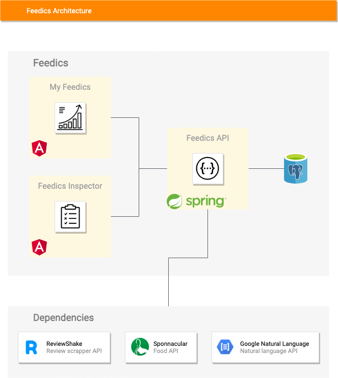

# Feedics

## What is Feedics ?
Feedics is a tool that centralize customer reviews from different platforms (Google, Zomato, Facebook, Expedia, Booking, ...) and turn them into meaningful insights by using nlp and artifical intelligence.

You can request a demo, by going [here](https://www.feedics.com/)

Check [Youtube video](https://www.youtube.com/watch?v=9kuanmTQvKU) to learn more 

  

## Technical architecture

  

## Stack
| Stack | Tools |
|-------|-------|
| Backend |      |
| Frontend |          |
| Devops |    |
| IDEs |   |
| Agile |  |

